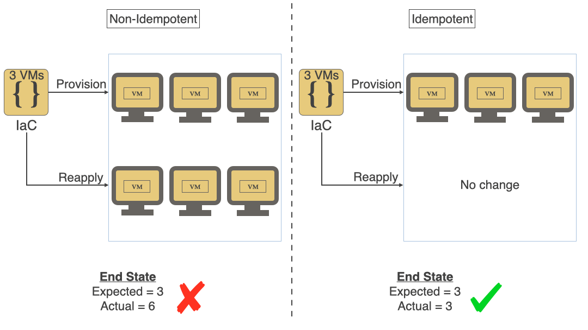
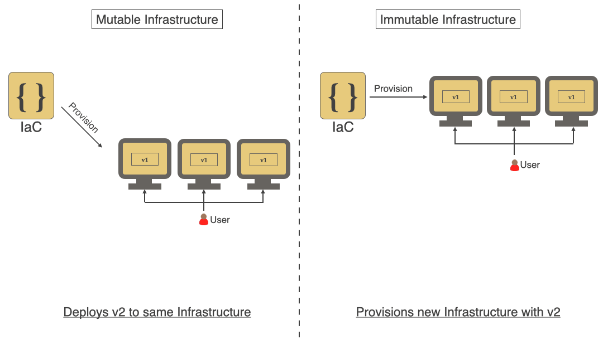
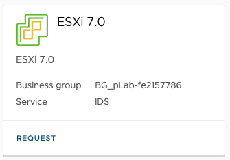
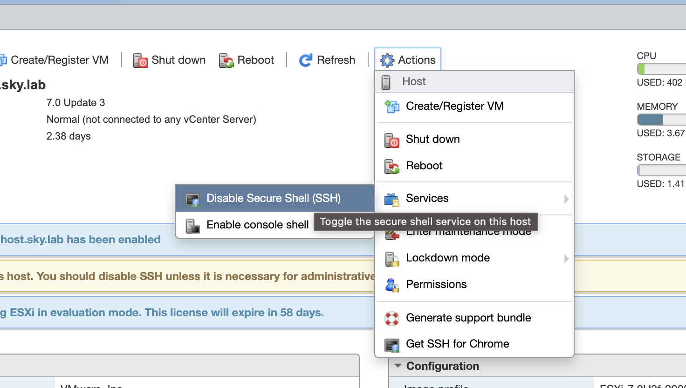
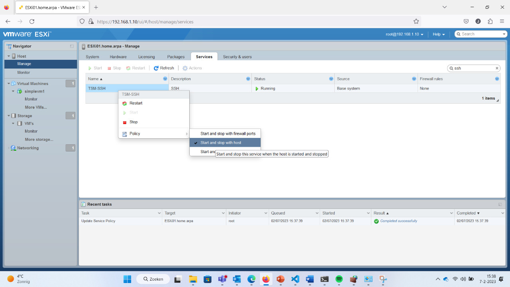

# Les 1 - Hello, IAC!

Datum: 6 september 2023

Leerdoelen:
1. Aan het einde van deze les weet je wat het begrip Infrastructure as Code betekend.
2. Aan het einde van deze les heb je een ontwikkelomgeving (VSCode, Git repository, ESXI Hypervisor) opgezet om je code op te gaan ontwikkelen en deployen

Inhoud:

  - Introductie vak IAC
  - Introductie Infrastructure as Code
  - Waarom IAC? Waarom _geen_ IAC?
  - Key Principes
  - Ontwikkelomgeving
  - Een eerste deployment
  - Opdracht tijd

## Introductie vak IAC

  - 7 weken
  - 3 uur per keer op je rooster
  - Elke week een thema
  - Ruimte om aan opdrachten te werken
  - Alle losse opdrachten bij elkaar vormt voor je eindopdracht
  - Aan het einde maak je een portfolio video waarin je laat zien dat alle opdrachten werken
  - Alle code moet in Gitlab (gitlab.windesheim.nl)
  - Bij elke week schrijf je een README.md wat je gedaan hebt en hoe de code werkt.

## Introductie Infrastructure as Code

Veel ontwikkelaars en systeembeheerders beheren servers door er via SSH op in te loggen, wijzigingen aan te brengen en uit te loggen. Sommige van deze veranderingen worden gedocumenteerd, andere niet. Als een beheerder dezelfde wijziging op veel servers moet aanbrengen (bijvoorbeeld één waarde in een configuratiebestand wijzigen), logt de beheerder handmatig in op elke server en brengt deze wijziging herhaaldelijk aan.

Als er in de loop van de levensduur van een server maar één of twee wijzigingen  optreden, als de server extreem eenvoudig zou zijn (bijvoorbeeld slechts één proces en een simpele configuratie) en als elke wijziging dan grondig gedocumenteerd zou zijn, zou dit geen probleem zijn.

Maar voor bijna elk bestaand bedrijf zijn servers complexer: de meeste draaien tientallen, soms honderden verschillende applicaties of applicatiecontainers lokaal of op een cloudomgeving. De meeste servers hebben gecompliceerde firewalls en tientallen aangepaste configuratiebestanden. En zelfs met wijzigingsdocumentatie zorgt het handmatige proces er meestal voor dat sommige servers of stappen worden vergeten.

Als de beheerders van deze bedrijven een nieuwe server zouden willen opzetten, precies zoals de server die momenteel draait, zouden ze veel tijd moeten besteden aan het doornemen van alle geïnstalleerde pakketten, het documenteren van (nieuwe) configuraties, versies en instellingen; en ze zouden veel onnodige tijd besteden aan het handmatig opnieuw installeren, updaten en aanpassen van alles om de nieuwe server dicht bij de oude server te laten werken.

Soms wordt er een shell script geschreven door beheerders om een bepaalde mate van herhaalbaarheid te hebben, maar vaak worden deze scripts enorm complex, zijn ze alleen begrijpelijk voor de maker ervan en zijn ze door onderliggende wijzigingen of andere configuratie (hardware/os) niet opnieuw uit te voeren.

##### Oefening 1:

Zoek op hoe je handmatig op een Linux systeem de applicaties nginx (webserver) en passenger (applicatie server) moet installeren, een basis configuratie geeft en er voor zorgt dat de services draaien.

**Uitwerking:**

```bash
root@server:~# # Install https support for apt
root@server:~# apt-get install apt-transport-https

root@server:~# # Add the passenger apt repository
root@server:~# vi /etc/apt/sources.list.d/passenger.list
root@server:~# chown root: /etc/apt/sources.list.d/passenger.list
root@server:~# chmod 600 /etc/apt/sources.list.d/passenger.list

root@server:~# # Update the apt cache so we can use the new repo
root@server:~# apt-get update

root@server:~# # Install nginx
root@server:~# apt-get install nginx-full passenger

root@server:~# # Set up passenger in the nginx configuration
root@server:~# vi /etc/nginx/nginx.conf

root@server:~# # Start nginx
root@server:~# service nginx restart
```

## Waarom IAC? Waarom _geen_ IAC?

Sommige beheerders proberen met alle mogelijke manieren vast te houden aan hun ooit ontwikkelde shell scripts. Zij weten hoe het in elkaar zit en op hun eiland zijn ze machtig. Waarom zouden ze het allemaal uit het raam gooien en een nieuwe configuratietaal en methode leren?

Maar gaan zij deze shell scripts of handmatige configuratie stappen toepassen op servers die tegenwoordig soms maar een dag, een uur of soms zelfs maar 1 enkele taak in een container in secondes afhandelen?

Stel: een ontwikkelaar maakt een applicatie die hij elke nacht wil testen op een geautomatiseerde manier. Voor elke test heeft hij een systeem nodig (VM of cloud instance). Hoe moeten deze scripts of handmatige stappen uitgevoerd worden? We hebben dus iets nodig wat zo'n server/instance herhaalbaar kan aanmaken en waar we zeker van kunnen zijn dat de uitkomst altijd gelijk is. De uitgangspunten voor iedere test moeten hetzelfde zijn.

##### Oefening 2:

Zet deze commando's uit oefening 1 eens op een rij in een shell (bash) script.

**Bash**
```bash
#!/bin/bash

# Install https support for apt
apt-get install apt-transport-https -y

# Add the passenger apt repository
echo "deb https://oss-binaries.phusionpassenger.com/apt/passenger raring main" > /etc/apt/sources.list.d/passenger.list
chown root: /etc/apt/sources.list.d/passenger.list
chmod 600 /etc/apt/sources.list.d/passenger.list

# Update the apt cache so we can use the new repo
apt-get update

# Install nginx
apt-get install nginx-full passenger -y

# Set up passenger in the nginx configuration
sed -i "s/# passenger_root/passenger_root/" /etc/nginx/nginx.conf
sed -i "s/# passenger_ruby/passenger_ruby/" /etc/nginx/nginx.conf

# Start nginx
service nginx restart
```

## Key Principes

### Idempotency & Desired State

Zoals net aangegeven willen we dat iedere wijziging die we doen dezelfde uitkomst heeft. Ook al voeren we een stuk code dus meerdere malen achter elkaar uit (op hetzelfde systeem of een ander), de uitkomst is telkens hetzelfde. In ons geval dus de Infrastructuur die we aan willen maken. Dit principe staat ook wel bekend als **Idempotency.**




### Declarative

Idempotency kan worden bereikt door een stateful tool te gebruiken met een **declaratieve** taal waarin de gewenste eindsituatie (**desired state**) wordt gedefinieerd en vervolgens is het de taak van de tool om in die eindstatus te komen. Als de eindstatus niet bereikt kan worden zal de verandering aan de infrastructuur mislukken. Het maakt dus voor de beheerder niet meer uit _hoe_ het gedaan wordt, daar zorgt de tool voor.

Dit is een heel andere manier van denken voor veel (infrastructuur) ontwikkelaars. Waar zij eerst gewend waren om op een imperatieve manier (een serie van) lostaande commando's of een shell script te gebruiken om tot een bepaalde status te komen die zij in hun hoofd hadden kan er met een declaratieve manier van denken volstaan met alleen de desired state.

Wat als we de commando's uit oefening 1 en 2 op een declaratieve manier willen opschrijven? Stel we gebruiken Ansible als tool:

```yaml
---
- hosts: all
  tasks:

  - name: Ensure the passenger apt repository is added
    apt_repository: 
      state=present
      repo='deb https://oss-binaries.phusionpassenger.com/apt/passenger raring main'

  - name: Ensure https support for apt is installed
    apt: 
      name: {{ item }}
      state=present
      with_items:
        - apt-transport-https
        - nginx-full
        - passenger

  - name: Ensure the nginx configuration file is set
    copy:
      src=/app/config/nginx.conf
      dest=/etc/nginx/nginx.conf

  - name: Ensure nginx is running
    service:
      name=nginx
      state=started
      enabled=true
```

Zie je dat het haast een leesbaar draaiboek is geworden? We programmeren geen commando's meer, maar geven in een draaiboekstijl aan wat er moet gebeuren.
### Immutability

Wanneer er gedurende een bepaalde periode allerlei wijzigingen in de infrastructuur worden aangebracht worden deze vaak niet over alle systemen tegelijk toegepast. Er onstaat dan Configuration Drift. Omgevingen gaan van elkaar afwijken op manieren die niet gemakkelijk reproduceerbaar zijn (denk maar aan handmatige commando's, versie/hardware verschillen). Configuration Drift zorgt voor een lastig beheersbare infrastructuur.

Een oplossing voor Configuration Drift is **immutable infrastructure**. Immutable betekent in dit geval dat in plaats van een bestaande infrastructuur te wijzigen deze vervangen zal worden door een nieuwe. Door elke keer nieuwe infrastructuur in te richten wordt ervoor gezorgd dat deze reproduceerbaar is en geen drift toestaat in de loop van de tijd.

Immutable infrastructuur maakt ook schaalbaarheid mogelijk bij het inrichten van infrastructuur in cloudomgevingen. Je kunt in diagram #2 hieronder zien dat voor veranderlijke (non-immutable) infrastructuur v2 van de applicatie wordt ingezet op dezelfde servers als v1, maar bij immutable infrastructuur worden er nieuwe VM's met v2 van applicatie aangemaakt.




### Versiebeheer

Er kunnen (kleine) veranderingen in de gewenste infrastructuur en dus code optreden in de loop van de tijd. We kunnen het ontwikkelen van infrastructuurcode vergelijken met 'normale' softwareontwikkeling waarbij versiebeheer de normaalste zaak van de wereld is. Versie 2.0 van een applicatie heeft bijvoorbeeld meer functies dan 1.0. Maar het moet ook mogelijk zijn om (snel) terug te kunnen naar versie 1.0 mocht 2.0 ondanks alle testen niet goed werken.
Doordat je je infrastructuur gaat definieren in code zullen er verschillende versies gaan ontstaan. 

Ook onze infrastructuur code slaan we dus op in een versiebeheersysteem. In dit vak gebruiken we de GitLab omgeving van Windesheim. (https://gitlab.windesheim.nl). Zorg dat je hier een account hebt waar je een project en repository kunt aanmaken.

Zie ook onderstaande YouTube video van HashiCorp:

[](https://youtu.be/OPDJXicUBuo)


### LAB
##### Ontwikkelomgeving (opdracht 1)

  - VPN naar Skylab pfsense is vereist
  - Ontwikkelomgeving kan Lokaal of Remote in Skylab (bv Windows Remote Desktop)

Omdat we code gaan ontwikkelen hebben we een ontwikkelomgeving nodig met een editor, maar ook een aantal IaC tools waar we gebruik van gaan maken. Er zijn een aantal oplossingen om deze omgeving in te richten.

Globaal zijn er de volgende mogelijkheden:

  - Ontwikkelen in VSCode op eigen laptop (Windows/Mac/Linux) (VSCode met SSH plugin) met Linux VM in Skylab voor IaC tools
  - Ontwikkelen in VSCode op eigen laptop Mac of Linux en daarop IaC tools
  - Ontwikkelen in VSCode op eigen laptop met WSL (Windows Subsystem for Linux) voor IaC tools

De voorkeur heeft om VSCode op je lokale (Windows of Mac) systeem te installeren en gebruik te maken van een Skylab (Ubuntu/Debian Server VM) en de Remote SSH extensie in VSCode. WSL kan ook, maar hier kunnen we geen ondersteuning op geven. Gebruik in ieder geval geen Desktop Linux varianten met een VNC Connectie, dit belast Skylab te zwaar en is een knock-out voor je beoordeling.

Hou de volgende volgorde aan om je ontwikkelomgeving op te zetten:

* Als allereerste moet je er voor zorgen dat je een VPN server op je PFSense hebt ingericht en dat je vanaf je laptop [verbinding](https://liveadminwindesheim.sharepoint.com/:w:/r/sites/skylab/_layouts/15/Doc.aspx?sourcedoc=%7BE351748D-49C7-4BF0-BE43-7CF0921C8BCA%7D&file=Stappenplan%20installatie%20OpenVPN%20Server%20op%20pfSense%20binnen%20Skylab-rev1.docx&action=default&mobileredirect=true) hiermee kunt maken.
* Begin daarna met het inrichten van je Windows omgeving. Gebruik hiervoor de README.md in de directory config-workstation-windows.
  Ga je WSL gebruiken? Installeer dit dan. Ga je dit niet gebruiken, ga dan verder naar de volgende stap.
* Deploy een Linux VM in skylab. Gebruik het Ubuntu 22.04 server image (24.04 kan ook, maar kan soms iets afwijken).
* Richt deze Linux VM in volgens de README.md in de config-workstation-linux directory. Deze Readme gebruik je ook als je WSL hebt gekozen.
* Gebruik daarna de README.md uit de config-vscode directory om VSCode op te zetten met de Remote-SSH extensie en je SSH-key. (Private key op je Windows workstation, publieke deel in authorized keys op je VM)

##### ESXi (opdracht 2)

Om de opdrachten uit te kunnen voeren heb je ook een ESXi omgeving nodig op Skylab. Deploy deze met default instellingen, 16GB ram + 50gb extra storage disk toekennen en koppel het netwerk aan studentnet0.



Log daarna in op de ESXi console met username **root** en wachtwoord **Welkom01!**
Daarna moet SSH toegang aan worden gezet via **Actions>Services>SSH**



Via **Manage->Services** kun je SSH altijd laten opstarten, zodat je dit niet elke keer hoeft te doen.



Maak als laatste een nieuwe datastore aan op je toegevoegde disk in ESXI. Noem deze **datastore1**
