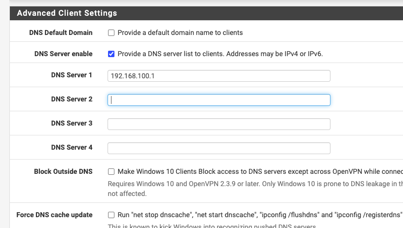
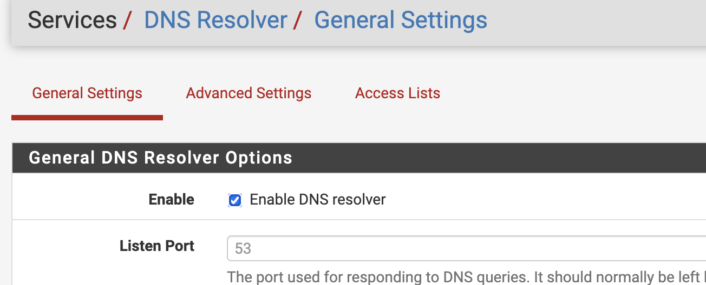
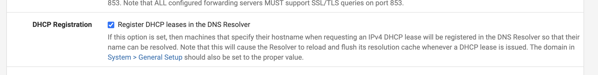

# Pfsense

## VPN
Maak een VPN aan via de handleiding zoals die in de FAQ van Skylab staat.
Zie hiervoor [de handleiding op skylab](https://liveadminwindesheim.sharepoint.com/:w:/r/sites/skylab/_layouts/15/Doc.aspx?sourcedoc=%7BE351748D-49C7-4BF0-BE43-7CF0921C8BCA%7D&file=Stappenplan%20installatie%20OpenVPN%20Server%20op%20pfSense%20binnen%20Skylab-rev1.docx&action=default&mobileredirect=true)
Zorg ervoor dat bij Advanced settings het IP van de PFSense server als DNS server genoemd staat.

## DNS
Om onze gedeployde vm's te kunnen benaderen willen we ze bekend hebben in de DNS server van PFsense.
Dat kan door hostnames toe te laten voegen door de DHCP server aan de DNS Resolver.
Enable daarvoor de DNS Resolver : 

Vink daarna de volgende optie aan :

