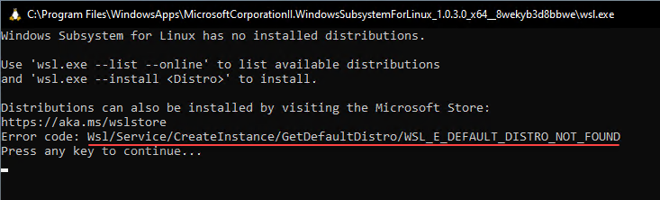
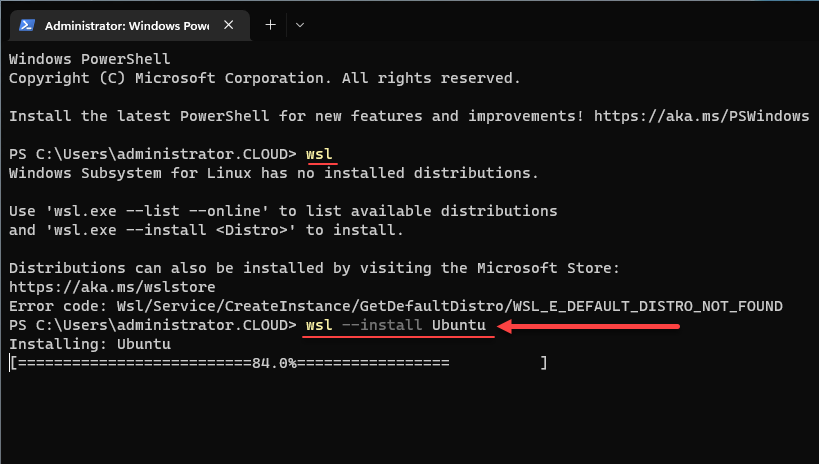
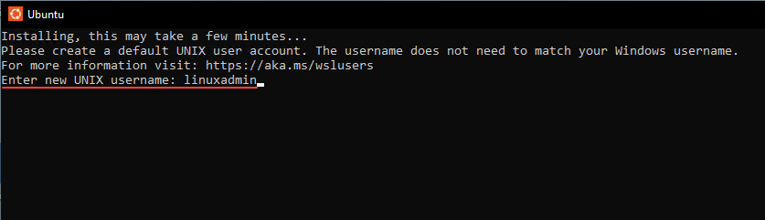
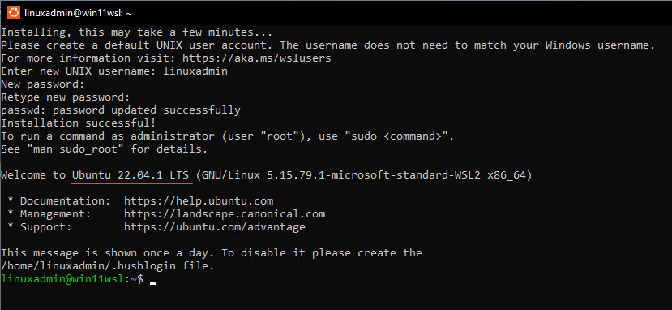

# Windows

Als je alleen lokaal gaat ontwikkelen en een Linux VM (in skylab) gebruikt om te deployen heb je genoeg aan de Windows Terminal app en VSCode. Windows Terminal staat standaard op je pc, VSCode moet je downloaden of installeren via winget

Zorg dat je een Terminal opent als Admin. Voer daarna de volgende commando's uit:

```bat
winget install Microsoft.VisualStudioCode
```
En eventueel:
```bat
winget install Git.Git
```

Clone deze repository naar een lokale map op je pc. Bijvoorbeeld C:\Users\%username%\Code en voer daar uit:

```bat
git clone https://gitlab.windesheim.nl/fe2157786/iac-files.git
```

Ga je gebruik maken van een remote Ubuntu/Debian VM als jumphost om je ansible en terraform commando's vanaf te starten, lees dan de config-vscode README.md. Je gaat dan gebruik maken van de Remote-SSH extensie in VSCode.

Een andere optie is WSL, dat is een lokale (Linux) VM op je eigen systeem. Voordeel van WSL is dat je altijd bij je code kan, maar soms wil het wat issues geven op verschillende installaties en Windows versies.

Mocht je gebruik willen maken van WSL om te deployen, lees dan verder

## WSL

Windows Subsystem for Linux (WSL) is een functie in Windows 10/11 wat jou als ontwikkelaar in staat stelt om Linux command-line gereedschappen direct te draaien op Windows. Het maakt gebruik van een virtualisatielaag om Linux te emuleren en biedt zo gebruikers een Bash-shell op hun Windows systeem. Dit maakt het voor ontwikkelaars mogelijk om Linux-tools en scripts op Windows te draaien zonder de noodzaak voor een externe virtuele machine of dual-booting.

Je kunt veel verschillende Linux-distributie-releases installeren, waaronder Ubuntu, Kali Linux, Debian, Arch Linux en andere. Je kunt je geïnstalleerde distributies tegelijkertijd parallel uitvoeren.

## Installatie WSL
Via de command line (cmd.exe)
```bat
wsl --install -d Ubuntu-20.04
```

We hebben hier voor Ubuntu gekozen. Er zijn een aantal mogelijkheden. Kies wat bij je past, maar in de rest van de voorbeelden wordt uitgegaan van Ubuntu.
Na de installatie moet je je computer herstarten.

## Errors 

Dit gedeelte kun je overslaan als je Ubuntu kunt starten.
Je kunt tegen de volgende error aanlopen:

```bat
Windows Subsystem for Linux has no installed distributions error
```



Dit bericht zegt dat we geen Linux-distributie geinstalleerd hebben, wat betekent dat we Ubuntu of een andere Linux-distributie moeten installeren. De handleiding gaat verder uit van Ubuntu, wil je iets anders installeren is dat je eigen keuze.

Je kunt het volgende commando gebruiken om de installatie van de Ubuntu-distributie te starten.

Open een Windows Terminal opent en voer het volgende commando uit:

```bat
wsl – install ubuntu
```



## Gebruik WSL

Na installatie van Ubuntu (via Microsoft store of commando) zal het volgende scherm verschijnen. Hier kan een gebruikersnaam op worden gegeven.



Wanneer Ubuntu klaar is voor gebruik verschijnt er een BASH prompt



## Configureren User

Normaal gesproken gebruik je het sudo commando om sommige taken binnen Linux als root-user uit te voeren. Wanneer je een sudo commando gebruikt moet je je wachtwoord opgeven. Omdat dit een ontwikkelomgeving is kan het handig zijn dit uit te schakelen.

Voer hiervoor het volgende uit:

```bash
sudo visudo
```

En voeg onderaan het bestand het volgende toe:

```bash
<gebruikersnaam> ALL=(ALL) NOPASSWD: ALL
```

En sla het bestand op. Nu vraagt Ubuntu/Linux niet langer om een wachtwoord wanneer je sudo gebruikt.

## Bestanden

In je WSL Ubuntu is de C schijf van je PC benaderbaar. Je kunt het vinden in de directory /mnt/c
Je eigen documenten zijn te vinden in /mnt/c/Users/<Windows gebruikersnaam>

Vanuit Windows kun je de bestanden benaderen via \\wsl$\
Het is handig om een directory in je home directory in Ubuntu te maken met bv de naam code of iac of iets dergelijks.

## VSCode
Voeg \\wsl$\Ubuntu\home\<username>\code (of hoe je directory heet) toe in de filebrowser links op het scherm.

Zie voor de verdere configuratie van VSCode de config-vscode README.md

## Configuratie Linux distro in WSL
Volg hierna de config-workstation-linux README.md om je WSL Linux te configureren.

## Known issues

Heb je problemen met DNS of het benaderen van je Windows host vanuit WSL?
Probeer [deze oplossing](https://github.com/microsoft/WSL/issues/4139#issuecomment-1028835084) eens.