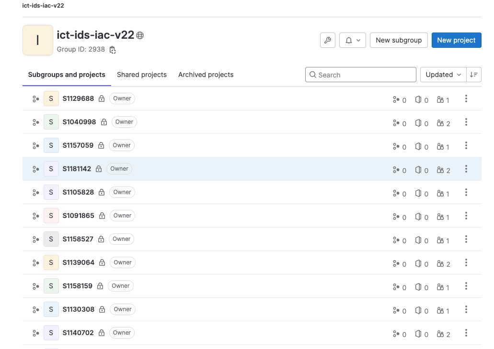
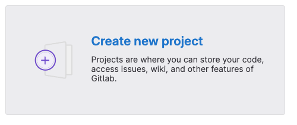
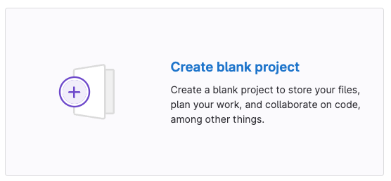
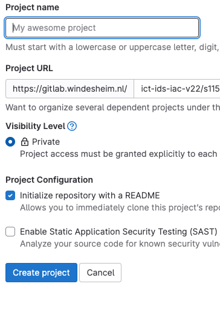
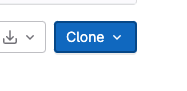
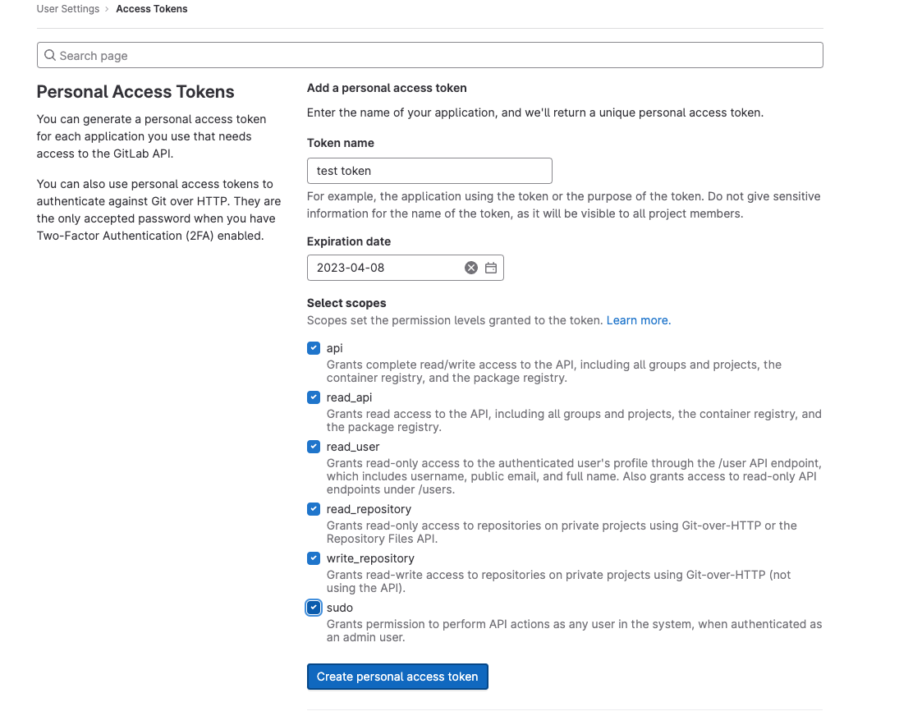
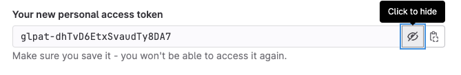

# Gebruik van Gitlab

Voor de praktijkopdracht is het een vereiste dat je je code in [Gitlab](https://gitlab.windesheim.nl) zet.
Je hebt in de [ict-ids-iac-v2324-1](https://gitlab.windesheim.nl/ict-ids-iac-v2324-1) groep een eigen ruimte (subgroup) gekregen, te herkennen aan je studentnummer.

Youtube:

[](http://www.youtube.com/watch?v=2uYeb_c8_bk "Using Git")

## Subgroup

In jouw eigen subgroup kun je standaard alleen zelf je code bekijken. De rechten zijn zo gezet dat een andere student jouw code niet kan zien. In deze subgroup kun je een eigen project aanmaken. Zo'n project noem je ook wel een repo (repository).
Deze repo gebruik je om je code in vast te leggen. Dat gaat op de volgende manier:

Je zoekt je studentnummer op in de lijst : 



Dan kom je in je subgroup terecht. Daar zie je twee buttons staan, klik op 'Create new Project'



en daarna op 'Create blank project'



In het scherm wat je nu te zien krijgt kun je een naam bedenken voor je project. Bijvoorbeeld iac-praktijkopdracht.



Klik vervolgens op 'Create project'

Je Project of Repo is nu gemaakt. Maar er staat nog geen code in.
Daarvoor moet je de repo clonen naar je lokale systeem (je WSL Ubuntu. of iets anders wat je gebruikt).
Klik voor het kopieren van de url in het scherm rechts op 'Clone'



En kopieer de url die hier staat.

Vervolgens ga je naar je WSL Ubuntu (of iets anders) en geef je het volgende commando:

```
git clone <url>
```
NB: neem <url> dus niet letterlijk, hier komt de url van je gitlab repo te staan.

Je repo wordt nu 'gecloned' naar je lokale systeem. Je kunt nu in deze directory gaan werken of je kopieert je bestaande bestanden hier naar toe.

Om bestanden toe te voegen aan git gebruik je de volgende set van commando's :

```
git add .
```
Hiermee zet je de bestanden klaar om toe te voegen.

```
git commit -m "Geef hier een commit message mee"
```
Hiermee maak je een commit aan in git, dus een soort punt in tijd waaraan de gewijzigde bestanden gekoppeld zijn.

```
git push
```
Nu zeg je tegen git dat je de committed bestanden beschikbaar wil maken in je repo.

Dit zijn de basis commando's om met git van Lokaal naar Remote (gitlab) te werken.

Wil je code van Remote (gitlab) naar Lokaal halen (bijvoorbeeld op een andere pc, op een server oid) dan gebruik je:

```
git clone <url>
```
Om de repo initieel op te halen.

En 

```
git pull
```
Om je lokale bestanden bij te werken met de laatste versie van de bestanden remote (op gitlab dus)

NB:

Krijg je de melding bij git dat je een Personal Access Token moet aanmaken? Doe dit dan als volgt :

Klik rechtsbovenin op het icoon van je gebruiker. Klik op Preferences.
Klik links in het menu op Access Tokens.
Geef het Token een naam bij 'Token name'
Selecteer alle scopes door een vinkje te zetten.
Klik op de button 'Create personal access token'.



LET OP: Je krijgt het token maar 1x te zien door op het oogje te klikken. Kopieer het bv in een password manager.



Wanneer het git commando vraagt om jouw username/password voer je je Windesheim email adres in met dit token als wachtwoord..
